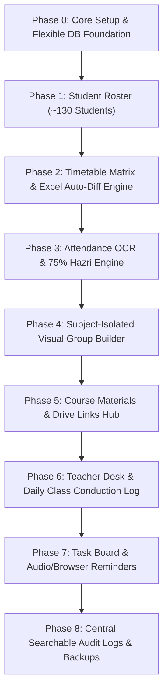

# CR Nexus - Phased Implementation Roadmap & Feature Guide

> **Development Philosophy**: Iterative, Phase-by-Phase Execution.  
> Every phase is modular and flexible. The CR (User) will guide the exact behavior, layout, and rules for each phase before and during implementation. The database and code are built with extreme flexibility (flexible SQLite schema + JSON metadata fields) so any future changes can be made smoothly without breaking existing data.

---

## 🏗️ Architecture & Extensibility Foundation

### 1. Database Flexibility Design
To make sure any requirement can be tweaked at any time without database lock-in:
* **SQLite (via Prisma / better-sqlite3)**: Fast, offline, file-based, zero setup.
* **Schema Evolution**: Core tables have typed fields for essentials (`id`, `createdAt`, `updatedAt`), plus **`metadata JSON`** / **`customFields JSON`** on every key entity (Students, Timetable, Attendance, Groups, Tasks).
* **Audit Logging Engine**: Universal logging function `logActivity(module, action, summary, details)` attached to all operations.

---

## 📋 Master Phase Breakdown

---

### 🔹 Phase 0: Flexible Core Setup & Dashboard Shell
* **Current Status**: 🟡 Ready to Begin
* **What We Build**:
  1. Next.js 14/15 + Tailwind CSS + Lucide Icons application shell.
  2. Tabbed navigation sidebar / header (Overview, Timetable, Attendance, Groups, Materials, Teachers, Tasks, Logs).
  3. Flexible SQLite database setup with Prisma ORM and JSON custom fields.
  4. Core universal Audit Logger model.
  5. 1-Click launcher script (`run_dashboard.bat`).
* **Flexibility & Change Tolerance**:
  - The UI layout is modular; tabs can be reordered, hidden, or added instantly.
* **User Input Needed for Phase 0**:
  - Preferred theme (Dark Mode, Light Mode, or System Default).
  - Any specific section code/name to display on the dashboard header (e.g. "BSCS 7th").

---

### 🔹 Phase 1: Student Master Roster (~130 Students)
* **Current Status**: ⚪ Queued
* **What We Build**:
  1. Central student directory holding up to ~130 students.
  2. Quick import tool: Paste text, paste Excel/CSV, or manual entry.
  3. Search & filter by roll number, name, or phone.
  4. Flexible custom fields (e.g., Section, Shift, Remarks, Status).
* **Flexibility & Change Tolerance**:
  - Can store any custom student attributes in `customFields JSON` without schema migrations.
* **User Input Needed Before Starting Phase 1**:
  - Format of student roll numbers (e.g., simple numbers 1-130, or `BCS21-xxx`, or University Registration numbers).
  - Sample student list if ready (or dummy data generator to test first).

---

### 🔹 Phase 2: Visual Timetable & Master Excel Auto-Diff Engine
* **Current Status**: ⚪ Queued
* **What We Build**:
  1. Visual weekly timetable grid (Days vs Time Slots).
  2. Interactive editing: Move classes, edit room numbers, change teachers or timings visually.
  3. **University Master Excel Auto-Diff**:
     - Upload campus-wide timetable `.xlsx` file.
     - Automatically find and isolate your class section.
     - Compare new timetable vs active timetable and highlight room changes, time shifts, and new/dropped classes.
     - 1-Click "Verify & Merge" with audit log.
  4. **WhatsApp Schedule Announcement Generator**:
     - 1-Click copy of clean, polite WhatsApp broadcast (no automatic spam).
* **Flexibility & Change Tolerance**:
  - Time slot intervals, days of the week, and display formats are dynamic and configurable in settings.
* **User Input Needed Before Starting Phase 2**:
  - Reference image / screenshot of your timetable format.
  - Typical time slots (e.g., 8:30-10:00, 10:00-11:30, etc.).
  - Sample university Excel timetable file (or its column structure).

---

### 🔹 Phase 3: Attendance Management (Photo OCR to 75% Hazri Ledger)
* **Current Status**: ⚪ Queued
* **What We Build**:
  1. Upload attendance sheet photo / paper scan.
  2. OCR Engine to detect roll numbers and Present/Absent markings.
  3. Interactive Fast Confirmation Modal:
     - Shows scanned results: `Present`, `Absent`, `Unclear`.
     - 1-Click toggle to correct any row before final saving.
  4. Real-time 75% eligibility calculation per subject and overall.
  5. Color-coded status:
     - 🟢 Eligible ($\ge 75\%$)
     - 🟡 Warning ($70\% - 74.9\%$)
     - 🔴 Short Attendance ($< 70\%$)
  6. 1-Click export to official Excel/PDF for teachers.
* **Flexibility & Change Tolerance**:
  - 75% threshold percentage can be customized per subject.
  - Attendance statuses (Present, Absent, Leave, Medical) can be configured.
* **User Input Needed Before Starting Phase 3**:
  - Sample photo of an attendance sheet to calibrate OCR accuracy.
  - The exact rules you follow for attendance marking (e.g., how leaves or teacher-cancelled classes are counted).

---

### 🔹 Phase 4: Subject-Isolated Visual Group Builder
* **Current Status**: ⚪ Queued
* **What We Build**:
  1. Visual Group Workspace with subject dropdown.
  2. Full isolation: Groups created in Subject A do NOT interfere with Subject B.
  3. Interactive UI: Click-to-assign, drag-and-drop, and unassigned students queue.
  4. Auto-balancer / Randomizer tool (e.g., divide class into $N$ groups of $K$ members).
  5. 1-Click "Copy Group List for WhatsApp" with neat formatting.
* **Flexibility & Change Tolerance**:
  - Allows variable group sizes, group leaders, project titles, and custom notes.
* **User Input Needed Before Starting Phase 4**:
  - How many subjects typically require groups?
  - Usual group sizes (e.g., 3-5 students) and if leaders need special tagging.

---

### 🔹 Phase 5: Course Materials & Drive Links Hub
* **Current Status**: ⚪ Queued
* **What We Build**:
  1. Subject-wise resource tabs (Slides, Handouts, Books, Past Papers, Assignment Briefs).
  2. Drive links manager with quick preview.
  3. 1-Click WhatsApp Announcement generator for new materials.
* **Flexibility & Change Tolerance**:
  - Can store both local file references and cloud Google Drive links.
* **User Input Needed Before Starting Phase 5**:
  - How you organize your Google Drive links and how you prefer WhatsApp links formatted.

---

### 🔹 Phase 6: Teacher Desk & Class Conduction Tracker
* **Current Status**: ⚪ Queued
* **What We Build**:
  1. Faculty directory with phone numbers, emails, office locations, and preferred times.
  2. Daily class conduction tracker:
     - Mark: `Held` / `Cancelled by Teacher` / `Rescheduled` / `Holiday`.
  3. Total semester class tally (classes held vs missed).
  4. WhatsApp polite inquiry generator for teacher confirmations.
* **Flexibility & Change Tolerance**:
  - Custom status labels and pre-set query message templates.
* **User Input Needed Before Starting Phase 6**:
  - Standard polite Urdu/English phrases you normally send to teachers to confirm classes.

---

### 🔹 Phase 7: Task Board & Audio/Browser Reminders
* **Current Status**: ⚪ Queued
* **What We Build**:
  1. CR Task Board (Assignments collection, Teacher follow-ups, Fee notices, Photocopies).
  2. Exact date & time reminder scheduler.
  3. Web browser notification + audible alert sound chime.
  4. Priority tags and countdown timers.
* **Flexibility & Change Tolerance**:
  - Reminders can be recurring or one-shot, with snooze options.
* **User Input Needed Before Starting Phase 7**:
  - Specific task categories and preferred reminder sound/timing.

---

### 🔹 Phase 8: Searchable Audit Logs & Safe Data Backups
* **Current Status**: ⚪ Queued
* **What We Build**:
  1. 100% Comprehensive Audit Logging: Every single change across all modules is saved permanently.
  2. Global search bar: Filter logs by roll number, student name, subject, date, or action.
  3. 1-Click Database Backup & Restore (`.json` or `.db` backup).
* **Flexibility & Change Tolerance**:
  - Logs are immutable and stored in a standalone table with full JSON payloads.
* **User Input Needed Before Starting Phase 8**:
  - What kind of search filters or export formats you find most convenient.

---

## 🚀 How We Work Together
1. We start with **Phase 0 (Core Setup & Flexible Database)**.
2. For each phase, you will tell me your exact use-case, preferences, and files (e.g. reference images, sample sheets, roll numbers).
3. We implement that phase, verify it with you, and only move to the next phase when you are 100% satisfied.
4. Any future change is easily handled thanks to our flexible JSON metadata architecture.
